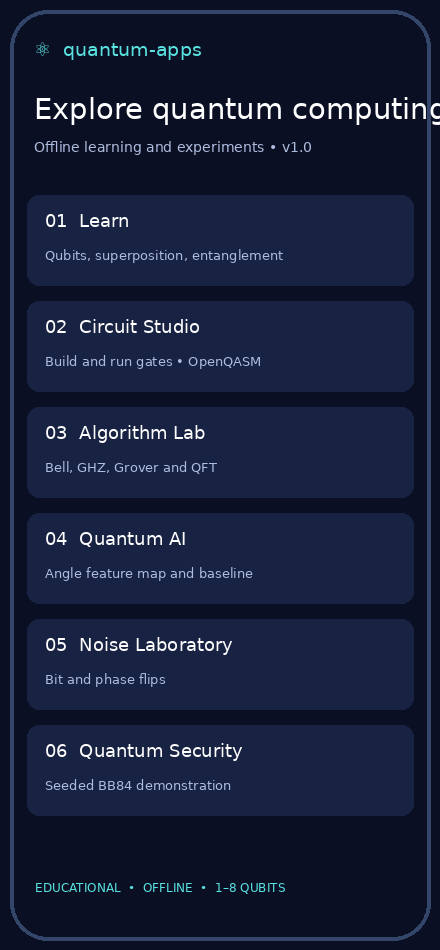
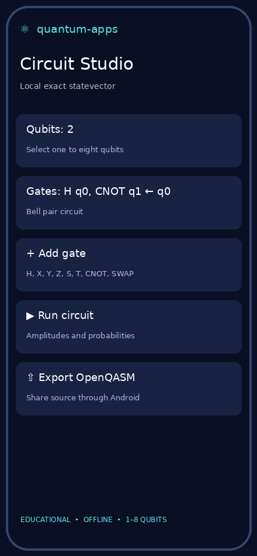
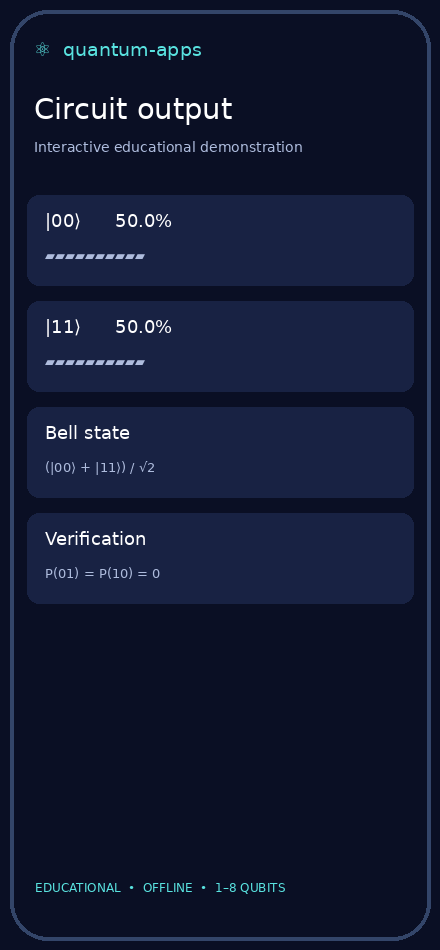

# quantum-apps

**An offline, modular quantum computing laboratory for Android.** Learn the mathematics, assemble small circuits, examine exact amplitudes, and compare instructive algorithm experiments. This is a working educational simulator; it does not claim access to quantum hardware or quantum advantage.

> **Release status:** v1.0 source and test APK. Native Android build verification is tracked by GitHub Actions. A debug APK is for hands-on testing; Play Store publication requires a separately signed Android App Bundle and store review.

## Interface previews

The images below are **design previews derived from the Android screens**, not device captures. Replace them with real screenshots after device testing.

| Dashboard | Circuit Studio | Bell result |
|---|---|---|
|  |  |  |

## Motivation and scope

Quantum algorithms are easiest to understand when abstract state transformations can be inspected. The app keeps its statevector simulator on-device, exposes elementary operations in a small circuit studio, and lets a learner move between concept and experiment. For a portfolio, the core engineering story is a testable complex-amplitude engine with explicit bit ordering and honest scientific boundaries.

| Lab | What a user can do | What the program actually computes |
|---|---|---|
| Learn | Open four concepts and inspect example outcomes | Basis state, Hadamard superposition, Bell pair probabilities |
| Circuit Studio | Select 1–8 qubits, add/remove gates, run, export | Exact complex statevector and probability distribution; OpenQASM 2 subset |
| Algorithm Lab | Open Bell, GHZ, Grover, QFT and Shor overview | Three-qubit GHZ, two-qubit Grover marked `|11⟩`, two-qubit QFT example; Shor is text only |
| Quantum AI | Inspect a quantum feature map beside a baseline | Analytic `P(1)=sin²(πx/2)` table; no training |
| Noise Laboratory | Examine idealized bit and phase flips | Analytic one-qubit channel outcomes at fixed `p=0.12` |
| Quantum Security | Follow the BB84 basis-sifting idea | Deterministic seeded toy exchange; no secure key management |
| Optimization | Examine an optimal route | Exact four-node traveling-salesperson permutation search; future QAOA reference |
| Benchmark Arena | Measure the local engine | Wall-clock throughput for 3,000 three-qubit GHZ circuits on the device |
| Hardware Explorer | Read hardware constraints | Explanatory content; no backend connection |
| About | Review limitations and privacy | On-device implementation disclosure |

### Circuit mechanics

An `n`-qubit pure state is a vector with `2ⁿ` complex entries,

\[ |\psi\rangle=\sum_{i=0}^{2^n-1} a_i|i\rangle,\quad\sum_i |a_i|^2=1. \]

`QuantumEngine` stores separate real and imaginary arrays. Qubit `q0` is the **least significant bit** of the basis-state index. Single-qubit matrix multiplication pairs indices that differ at target bit `2^q`; `CNOT` swaps the pair only if the control bit is one. A measurement histogram displays `P(i)=Re(aᵢ)²+Im(aᵢ)²`. It reports exact probabilities, rather than randomly sampled shots.

Supported gates are `H`, `X`, `Y`, `Z`, `S`, `T`, `CNOT` and `SWAP`. A circuit begins in `|0…0⟩`; gates act in insertion order. The OpenQASM exporter emits a minimal OpenQASM 2 header, `qreg`, and supported gate statements. It does not serialize measurement operations or import arbitrary QASM.

**Example: Bell pair.** `H(q0)` maps `|00⟩` to `( |00⟩+|01⟩ )/√2` under little-endian indexing. `CNOT(q0→q1)` gives `( |00⟩+|11⟩ )/√2`; the histogram is 50% `00`, 50% `11`. Individual outcomes are random on a device, but ideal-state correlation is exact here.

**Grover example.** Two Hadamards prepare a uniform superposition; a controlled phase marks `|11⟩`, and inversion about the mean amplifies the marked item. For a four-element search, a single ideal Grover iteration gives unit marked-state probability. This small example demonstrates amplitude interference, not practical speedup.

**Quantum Fourier transform example.** The two-qubit demonstration combines Hadamards, a controlled phase equivalent for the populated input state, and a final bit-order swap. Inspect complex amplitudes as well as probabilities: phase information cannot be recovered from a histogram alone.

**Quantum ML boundary.** The angle feature map uses `Ry(πx)|0⟩`, whose measurement probability for `|1⟩` is `sin²(πx/2)`. The current lab evaluates that analytic curve and names a classical threshold reference; it contains no learned parameter, dataset, training loop, or superiority claim.

**Noise and BB84 boundaries.** The noise lab evaluates a fixed single-qubit Bernoulli error model; it is not density-matrix evolution or a calibrated physical device. The BB84 lab uses seeded pseudorandom choices and ideal matching-basis comparisons to teach sifting; it is not cryptographic software.

### Complexity and limits

| Operation | Time | Extra state memory |
|---|---:|---:|
| Initialize `n` qubits | `O(2ⁿ)` | `O(2ⁿ)` complex amplitudes |
| Apply one gate | `O(2ⁿ)` | `O(1)` beyond state |
| Compute probabilities | `O(2ⁿ)` | `O(2ⁿ)` result |
| Execute `g` gates | `O(g·2ⁿ)` | `O(2ⁿ)` |

The UI caps circuits at eight qubits (256 complex amplitudes), keeping the mobile interaction responsive. There is no backend, authentication, analytics, advertising, network permission, hardware provider integration, or arbitrary QASM parser.

## Project layout

```text
app/src/main/java/com/vivekmlresearch/quantumapps/
├── app/MainActivity.java          Android screens and interactions
└── core/
    ├── QuantumEngine.java         Gate matrices, statevector, QASM
    └── Labs.java                  Reproducible demonstrations
app/src/test/                     Desktop Java correctness checks
docs/previews/                    Labeled interface illustrations
.github/workflows/android.yml     Core tests and debug APK build
```

## Build and test

1. Open this repository in Android Studio with JDK 17 and Android SDK API 36. Sync Gradle, then run the `app` configuration on a physical Android device (Android 8.0 or newer).
2. For a quick correctness check, run `bash test-core.sh` with JDK 17. It checks Bell and GHZ probabilities, Y/T gates, the two-qubit Grover target, and QASM export.
3. In **Circuit Studio**, tap **Load Bell example → Run circuit**. Expect `P(00)=P(11)=0.5`, `P(01)=P(10)=0`. Change qubits and gates, undo, export, and open each lab. Check navigation, small screens, offline mode, and rotation.
4. On each push to `main`, Actions executes the Java check, builds `app-debug.apk`, and retains it as `quantum-apps-debug-apk` for installation/testing.

**Install a debug APK:** download the Actions artifact, extract it, and install `app-debug.apk` on a test device. Android may ask you to permit installs from the file manager used. This package is signed with a debug certificate and cannot be uploaded to Google Play as a release.

## Android distribution

- Application ID: `com.vivekmlresearch.quantumapps`. Name shown on device: `quantum-apps`.
- Target API: 36; minimum API: 26. Confirm the Play target requirement again when releasing.
- Generate a *signed release AAB* using a private upload keystore in Android Studio. Do not put the keystore, passwords, or release binaries in Git.
- Complete a privacy policy, data safety, content rating, screenshots from a real device, and any applicable Play closed-test requirement. `PLAY_STORE.md` contains draft copy.
- The debug APK is a test artifact. Release signing, Play Console submission, and device compatibility remain separate gates.

## Privacy and security

The Android manifest requests zero permissions. All simulations are local and no personal data is collected. The export button invokes Android's standard share chooser and shares the user's circuit text only after the user selects a recipient app. Review these statements if analytics, cloud backends or third-party libraries are added.

## Roadmap

1. Actual device screenshots, accessibility labels, and verified small-screen layouts.
2. Import/validation for a documented OpenQASM subset; persisted projects and undo history.
3. Density matrices, user-controlled noise, shot sampling, confidence intervals and device benchmarks.
4. Real trainable variational circuits with dataset splits and classical baselines; QAOA objective and optimizer.
5. Optional, separately consented hardware/cloud adapters with transparent costs and reproducible backend metadata.

## License

MIT; see [LICENSE](LICENSE). Examples are educational and carry no claims of cryptographic security, quantum advantage, or suitability for financial or safety-critical decisions.
